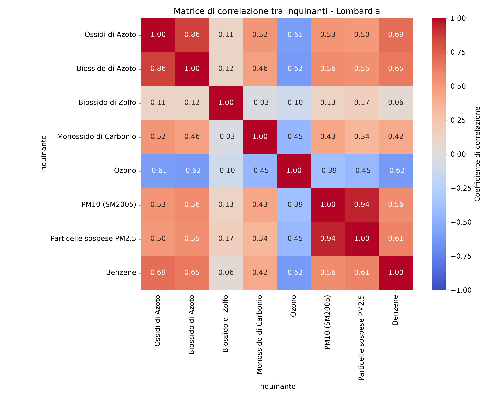
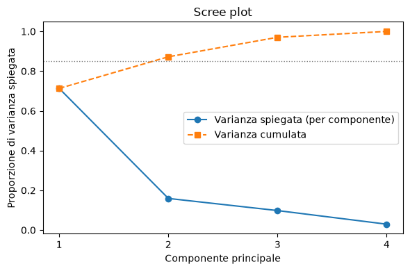
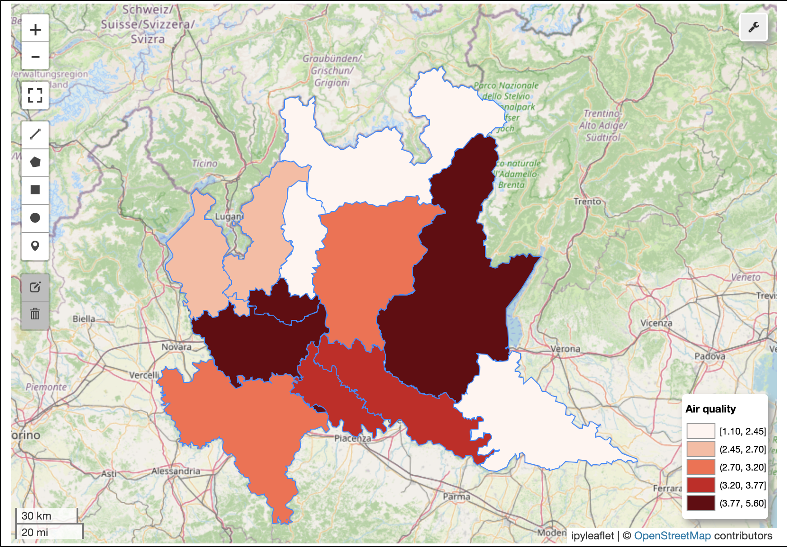
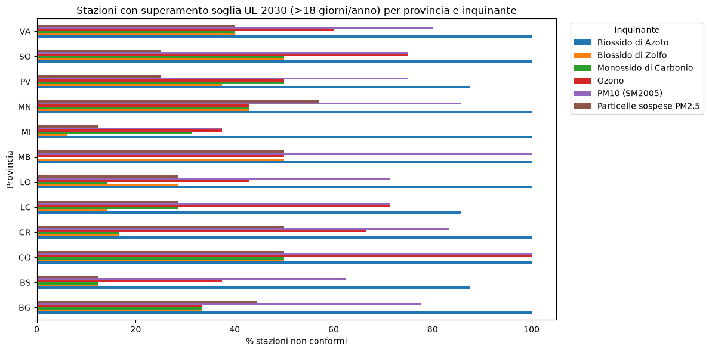
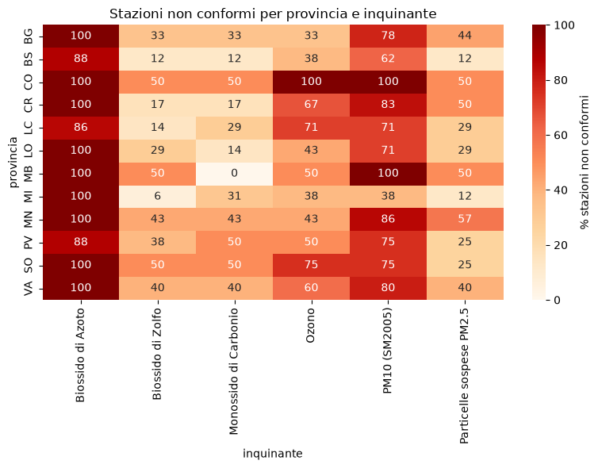
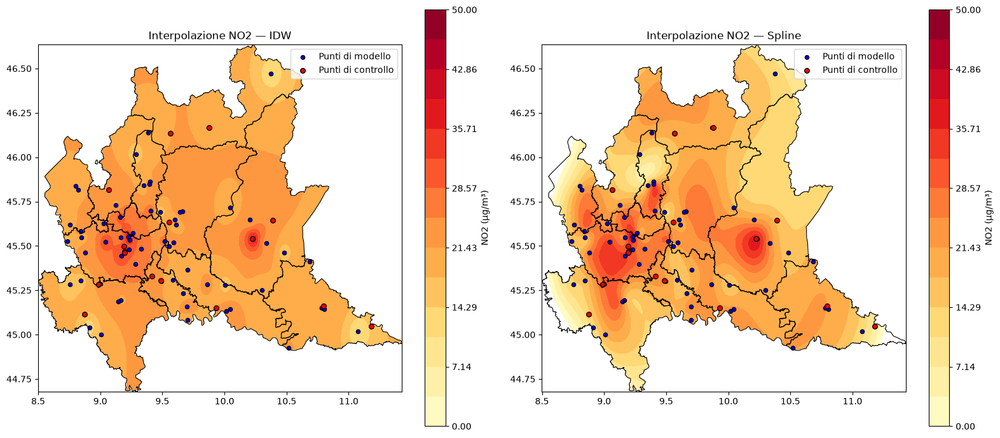

# Analisi della qualità dell'aria in Lombardia nel 2025

Analisi della qualità dell'aria nelle province della Lombardia nel 2025, a partire dai dati delle stazioni di monitoraggio ARPA Lombardia. Il progetto esplora le relazioni statistiche tra inquinanti, costruisce un indice di qualità dell'aria a livello provinciale, valuta la conformità rispetto ai nuovi limiti UE in vigore dal 2030, e produce mappe di interpolazione spaziale per il Biossido di Azoto (NO2).

## Dati

I dati provengono dal portale Open Data di Regione Lombardia:

- [Dati dei sensori di qualità dell'aria](https://www.dati.lombardia.it/Ambiente/Stazioni-qualit-dell-aria/ib47-atvt/about_data)
- [Anagrafica stazioni di qualità dell'aria](https://www.dati.lombardia.it/Ambiente/Stazioni-qualit-dell-aria-NRT/9xaz-9vbz/about_data)
- [Limiti amministrativi delle province](https://www.dati.lombardia.it/Territorio/Limiti-amministrativi-Province-2020-con-aggiorname/dsyz-3t5i/about_data)

**Periodo analizzato:** 1 gennaio 2025 – 30 dicembre 2025
**Copertura geografica:** province della Lombardia

## Struttura del repository

```
air-quality-lombardy-2025/
├── README.md
├── requirements.txt
├── .gitignore
├── data/                                 # dati grezzi
├── notebooks/
│   ├── 01_correlazione_pca.ipynb
│   ├── 02_indice_qualita_aria.ipynb
│   ├── 03_superamenti_soglie_UE.ipynb
│   └── 04_interpolazione_spaziale.ipynb
│   └── functions.py                      # funzioni condivise tra i notebook
└── output/                               # immagini e risultati esportati
```

## I 4 notebook

### 1. Matrice di correlazione e PCA
Analizza le relazioni statistiche tra 8 inquinanti (NOx, NO2, SO2, CO, O3, PM10, PM2.5, Benzene) attraverso una matrice di correlazione e un'analisi delle componenti principali (PCA), come base esplorativa per le analisi successive.



Pattern principali emersi: forte correlazione tra NOx e NO2 (0.86) e tra PM10 e PM2.5 (0.94), coerentemente con la relazione diretta tra questi inquinanti; l'ozono è correlato negativamente con quasi tutti gli altri inquinanti (es. -0.62 con NO2 e Benzene), coerentemente con la sua dinamica fotochimica legata al traffico.



Le prime 2 componenti principali spiegano circa l'87% della varianza totale, indicando che la variabilità tra gli 8 inquinanti è riconducibile in gran parte a 2 fattori latenti: un fattore "inquinamento da traffico/combustione" e un fattore "inquinamento fotochimico".

### 2. Indice di qualità dell'aria
Calcola un indice di qualità dell'aria complessivo per ciascuna provincia, a partire dagli stessi 8 inquinanti del notebook 1. Metodologia: normalizzazione con `MinMaxScaler()` e indice finale come somma dei valori normalizzati.



Le province con indice di qualità dell'aria peggiore sono Milano, Monza e Brescia; qelle con indice di qualità migliore sono Sondrio e Lecco.

### 3. Giorni di superamento delle soglie UE 2030
Calcola per ciascuna stazione/provincia il numero di giorni di superamento delle soglie sulla protezione della salute umana previste dalla **Direttiva UE 2024/2881** (vincolante dal 1° gennaio 2030), applicate su 6 inquinanti (NO2, SO2, CO, O3, PM10, PM2.5), per valutare quanto lavoro resta da fare per raggiungere la conformità.

Soglie utilizzate (max 18 superamenti/anno per ciascun inquinante):

| Inquinante | Soglia |
|---|---|
| PM10 | media giornaliera 45 μg/m³ |
| PM2.5 | media giornaliera 25 μg/m³ |
| NO2 | media giornaliera 50 μg/m³ |
| Ozono | 120 μg/m³ (approssimazione su media giornaliera 24h, in luogo della media mobile massima su 8h prevista dalla normativa) |
| SO2 | 50 μg/m³ |
| CO | 4 mg/m³ |



Il Biossido di Azoto (NO2) è l'inquinante più critico: quasi tutte le province hanno il 100% delle stazioni non conformi rispetto alla soglia 2030.



### 4. Interpolazione spaziale
Interpola il valore medio annuale di NO2 sull'intera superficie regionale a partire dai valori puntuali delle stazioni, con due metodi a confronto: **IDW** (Inverse Distance Weighting) e **Spline**.



L'interpolazione spaziale del Biossido di Azoto sulla Lombardia mostra due hotspot, uno sull'area metropolitana di Milano e un secondo su Brescia.

L'IDW produce una superficie più "morbida" e conservativa, tendendo a creare pattern concentrici visibili attorno alle singole stazioni. Mentre lo Spline cattura gradienti più marcati e transizioni più realistiche tra le zone urbane e quelle rurali.

## Strumenti utilizzati

`pandas` · `geopandas` · `matplotlib` · `seaborn` · `scikit-learn` (`StandardScaler`, `PCA`) · `scipy` (`Rbf`, `griddata`) · `shapely` (incluso `shapely.vectorized.contains` per il mascheramento geografico) · `leafmap`/`folium` (mappe interattive)

## Come eseguire il progetto

```bash
git clone https://github.com/giuliapezzuto02-netizen/air-quality-lombardy-2025.git
cd air-quality-lombardy-2025
pip install -r requirements.txt
```

Scarica i dati dai link indicati sopra e posizionali nella cartella `data/`, poi esegui i notebook in ordine (01 → 04).

## Autore

Sviluppato come progetto personale nell'ambito del percorso di laurea magistrale in Ingegneria Ambientale.

[LinkedIn](www.linkedin.com/in/giulia-pezzuto-309051245) · [GitHub](https://github.com/giuliapezzuto02-netizen)
